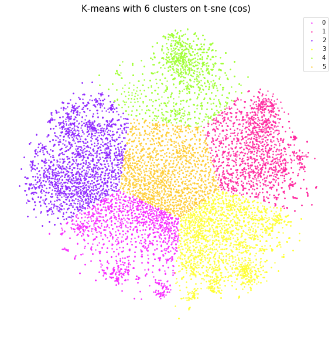
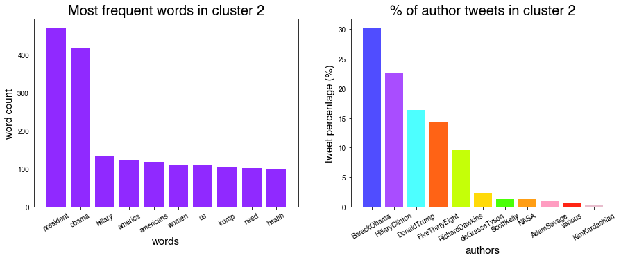
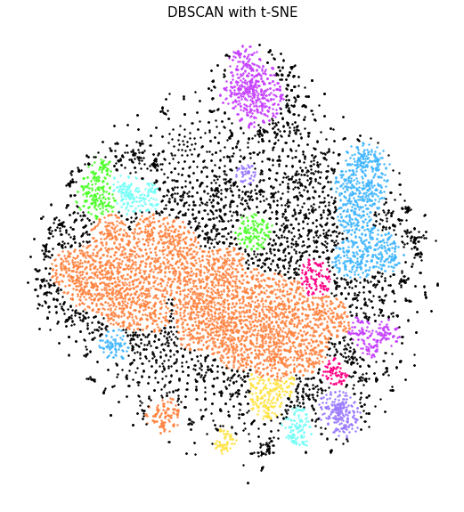
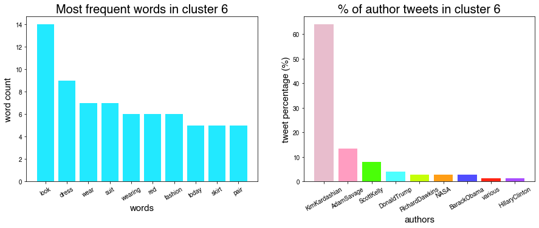
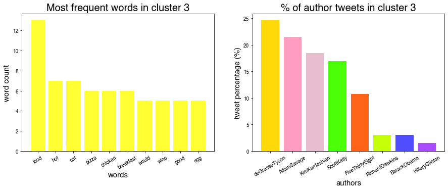

# tweet-clustering

 

[Full project report](https://github.com/mkcyoung/tweet-clustering/blob/main/Clustering%20Final%20Project.pdf)

## Exploring the relationships between tweets using dimensionality reduction and clustering.

It’s hard to imagine a world pre-Twitter. A world where people’s random thoughts were expressed only to their distracted spouses or disinterested pets. A world where the president of the United States only communicated with the public through thoughtful and painstakingly planned press conferences. A world where this [video](https://twitter.com/businesspastel/status/1254392896138227712?s=21) didn’t exist, in fact, probably couldn’t exist. For better or worse, that world is no more and what we have instead is a micro-blogging platform that is essentially one gargantuan dataset.  

There are many potential ways to explore this dataset, but here we're primarily interested in seeing **how the tweets of well known accounts are related to each other.** We explore this question using only the raw text of the tweets themselves. We have over 88 thousand tweets from 11 well-known accounts which we use in our analysis. We use various dimensionality reduction techniques paired with clustering methods to probe for any kind of interesting structure in the tweets that could help answer our question.
  
## Vectorizing tweets

In order to cluster tweets, we first need to define some notion of a "distance" between them. My approach to this was to convert the raw text of tweets to vectors using [GloVe](https://nlp.stanford.edu/projects/glove). The tokenizing of the tweets was accomplished using [NLTK](https://www.nltk.org/api/nltk.tokenize.html), and [genism](https://radimrehurek.com/gensim/) was used along with GloVe to convert the tokenized tweets to vectors we could use for dimensionality reduction and clustering.  

## Dimensionality Reduction

Due to the "curse of dimensionality," it's often a good idea to reduce the dimensionality of your feature space before clustering or running any kind of distance-based analysis. We used [scikit-learn's](https://scikit-learn.org/stable/) implementations of [t-SNE](https://en.wikipedia.org/wiki/T-distributed_stochastic_neighbor_embedding), [PCA](https://en.wikipedia.org/wiki/Principal_component_analysis) and [LDA](https://en.wikipedia.org/wiki/Linear_discriminant_analysis) to reduce the vectorized tweets to more manageable dimensions before clustering.
  
Through trial and error, we found that using t-SNE with the 200 dimensional GloVe-embedded tweet vectors produced the best way to visualize the tweets.

 
  
Immediately some structure is
apparent. The red blob near the top of the
plot consists of only tweets from kdNuggets. The
chromatically cool colors (blues and purples)
correspond to the political accounts (obama,
clinton, and trump) and seem to be
concentrated to the left of the plot.
Fivethirtyeight (orange) was mixed in there
as well, which makes sense because they do
a lot of political-themed data work. The
longer one stares at this plot the more
relationships that make sense come to light.
  
## Clustering

Running scikit learn's implementation of [k-means clustering](https://en.wikipedia.org/wiki/K-means_clustering) on the above t-SNE data produced results supporting many of the qualitative insights about the tweet relationships discussed above. For instance cluster 2 (purple) is in the location that appeared to be composed of mostly political tweets, and the cluster results report this, with ‘president’, ‘obama’, ‘hillary’, and ‘america’ being the most common words in the cluster.

 
 

Next we ran scikit learn's implementation of [DBSCAN](https://scikit-learn.org/stable/modules/generated/sklearn.cluster.DBSCAN.html) on the t-SNE data and found some interesting clusters. For instance, cluster 6’s most frequent words are ‘look’, ‘dress’, and ‘wear’, and the most frequent author by far is Kim Kardashian. This is clearly a “fashion” cluster. Cluster 3’s most popular tweets are ‘food’, ‘hot’, ‘eat’, and ‘pizza’, and the most common authors are Neil Degreasse Tyson, Adam Savage, Kim Kardashian, and Scott Kelly - all tweeters with individual
accounts who may be more likely to tweet about their personal lives. This is clearly a ‘food’ cluster.

 

  
For more results involving clustering using PCA, check out the [full report](https://github.com/mkcyoung/tweet-clustering/blob/main/Clustering%20Final%20Project.pdf).

## Acknowledgements

This was my final project for the course CS 6180: Clustering, taught by [Suresh Venkatasubramanian](http://www.cs.utah.edu/~suresh/) at the University of Utah. My partner for this project was Daniel Merrel, who focused more on using TF-IDF in his analysis. 

